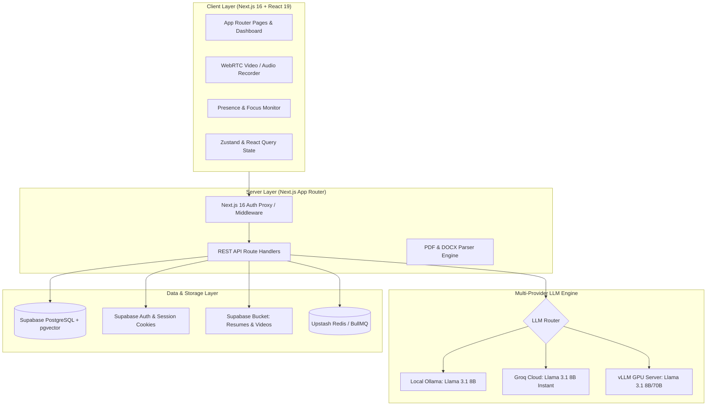

<div align="center">

# 🚀 HireNex

### **Next-Generation AI Talent Assessment & Career Intelligence Platform**

[](https://nextjs.org/)
[](https://react.dev/)
[](https://www.typescriptlang.org/)
[](https://supabase.com/)
[](https://tailwindcss.com/)
[](LICENSE)

<p align="center">
  <b>Practice interviews with adaptive AI, analyze resumes against ATS algorithms, close skill gaps with dynamic learning roadmaps, and connect with top recruiters — with 100% privacy-first, self-hosted AI architecture.</b>
</p>

[Key Features](#-key-features) • [System Architecture](#-system-architecture) • [Tech Stack](#-tech-stack) • [Quick Start](#-quick-start) • [Environment Variables](#-environment-variables) • [Project Structure](#-project-structure) • [Database Schema](#-database-schema) • [API Reference](#-api-reference)

---

</div>

## 📖 Overview

**HireNex** is an end-to-end career intelligence and talent recruitment ecosystem built for modern developers, job seekers, and hiring teams. Traditional hiring tools are fragmented, opaque, and leak sensitive candidate data to third-party proprietary AI APIs.

HireNex solves this by offering a unified, privacy-first platform:
- **For Candidates**: Real-time AI mock interviews with video proctoring, instant ATS resume scoring, adaptive skill quizzes, and personalized roadmaps.
- **For Recruiters**: Automated talent screening, candidate readiness metrics, searchable talent pools, and verified assessment reports.
- **Privacy-First Foundation**: Engineered to run on self-hosted open LLMs (**Llama 3.1** via Ollama or vLLM) as well as cloud providers (Groq), ensuring resume and biometric data stay confidential.

---

## ✨ Key Features

### 🎙️ 1. AI Mock Interviewer (Text, Audio & Video)
- **Role-Tailored Dynamic Questioning**: Questions adapt in real-time based on candidate answers, experience level, and role requirements.
- **Multimodal Video & Audio Practice**: WebRTC-powered live audio/video recording with immediate playback.
- **Real-Time Proctoring & Presence Monitoring**: Client-side presence tracking (focus loss detection, attention scoring, ambient checks) for interview integrity.
- **Comprehensive Evaluation Reports**: Scores candidates on technical depth, clarity, communication, and confidence with actionable feedback.

### 📄 2. AI Resume & ATS Gap Analyzer
- **Multiformat Extraction**: High-speed PDF and DOCX text parsing.
- **ATS Compatibility Score**: Checks keyword saturation, structure, readability, and formatting against target job specifications.
- **Skill Gap Matrix**: Identifies missing core competencies, recommended tools, and certifications needed to become a 90%+ match.

### 🗺️ 3. Personalized Learning Roadmaps
- **Dynamic Milestone Generation**: Generates role-based career paths (Frontend, Backend, DevOps, AI Engineer, Full Stack, etc.).
- **Interactive Checklists**: Track progress through curriculum phases, recommended resources, and hands-on projects.
- **Continuous Recalibration**: Automatically updates your readiness score as milestones and assessments are completed.

### ⚡ 4. Adaptive Technical Skill Assessments
- **AI-Generated Quizzes**: Dynamic MCQ and coding challenges tailored to your claimed tech stack.
- **Instant Code & Logic Scoring**: Automated grading with detailed explanations, test cases, and difficulty progression.
- **Cheat-Resistant Sessions**: Timed assessment windows with progress persistence.

### 👥 5. Recruiter Candidate Portal
- **Talent Discovery Pipeline**: Search and filter candidates by readiness index, verified test scores, skills, and target roles.
- **Detailed Candidate Profiles**: View verified interview performance cards, resume match scores, and activity timelines.
- **Fast-Track Sourcing**: Shortlist top percentile talent backed by objective, reproducible AI assessments.

---

## 🏗️ System Architecture



---

## 💻 Tech Stack

| Domain | Technologies |
|---|---|
| **Frontend Framework** | [Next.js 16 (App Router)](https://nextjs.org/), [React 19](https://react.dev/), [TypeScript 5](https://www.typescriptlang.org/) |
| **Styling & UI** | [Tailwind CSS v4](https://tailwindcss.com/), Radix UI Primitives, Lucide Icons, Framer Motion |
| **State & Data Fetching** | [Zustand](https://zustand-demo.pmnd.rs/), [TanStack React Query v5](https://tanstack.com/query/latest) |
| **Database & Auth** | [Supabase](https://supabase.com/) (PostgreSQL 15+, Row Level Security, pgvector, Storage, Auth) |
| **AI / LLM Providers** | Multi-engine adapter: [Ollama](https://ollama.ai/) (local), [Groq](https://groq.com/) (ultra-fast inference), [vLLM](https://vllm.ai/) (production cluster) |
| **Document Processing** | `pdf-parse`, `mammoth` (DOCX parsing) |
| **Queue & Cache** | [BullMQ](https://docs.bullmq.io/), [Upstash Redis](https://upstash.com/) |
| **Analytics & Charts** | [Recharts](https://recharts.org/) |
| **Notifications & Mail** | [Resend](https://resend.com/), React Hot Toast |

---

## 📁 Project Structure

```text
HIRENEX/
├── public/                     # Static assets & brand graphics
├── src/
│   ├── app/
│   │   ├── (app)/              # Protected authenticated application routes
│   │   │   ├── dashboard/      # Candidate performance & readiness dashboard
│   │   │   ├── interview/      # Mock interview rooms (Text/Voice & Video)
│   │   │   │   └── video/      # Multimodal video interview room
│   │   │   ├── profile/        # User profile, preferences & target roles
│   │   │   ├── recruiter/      # Recruiter talent discovery portal
│   │   │   ├── resume/         # Resume upload, parser & ATS analyzer
│   │   │   ├── roadmap/        # Dynamic career learning roadmap
│   │   │   └── tests/          # Adaptive technical quizzes & coding tests
│   │   ├── api/                # REST API backend routes
│   │   │   ├── interview/      # Start, respond, video chunk, and complete endpoints
│   │   │   ├── profile/        # Profile fetch & mutation
│   │   │   ├── recruiter/      # Candidate listings & filter queries
│   │   │   ├── resume/         # File upload & parsing status polling
│   │   │   ├── roadmap/        # Milestone generation & completion toggles
│   │   │   └── tests/          # Test question generation & automated scoring
│   │   ├── auth/               # Login, registration & OAuth callback handlers
│   │   ├── globals.css         # Design system tokens, utilities & theme variables
│   │   ├── layout.tsx          # Root layout with fonts & metadata
│   │   └── page.tsx            # Marketing landing page
│   ├── components/
│   │   ├── interview/          # VideoRecorder, PresenceMonitor
│   │   └── layout/             # Sidebar, Header, Nav components
│   ├── lib/
│   │   ├── llm/                # Universal LLM client (Ollama, Groq, vLLM)
│   │   ├── resume/             # PDF/DOCX analyzer & ATS matching engine
│   │   └── supabase/           # Client-side & Server-side Supabase clients
│   ├── proxy.ts                # Next.js 16 route proxy (route protection)
│   └── types/
│       └── database.ts         # TypeScript schema and application interfaces
├── supabase/
│   └── migrations/
│       └── 001_initial_schema.sql  # Complete schema, RLS policies & triggers
├── .env.local.example          # Template environment variable config
├── next.config.ts              # Next.js compiler & runtime settings
├── package.json                # Project dependencies & scripts
└── tsconfig.json               # TypeScript strict configuration
```

---

## ⚡ Quick Start

### 1. Prerequisites
Ensure you have the following installed:
- **Node.js**: `v20.x` or later (LTS recommended)
- **npm** / **pnpm** / **yarn** / **bun**
- **Git**
- *(Optional for local AI)*: [Ollama](https://ollama.ai/) with model `llama3.1:8b`

### 2. Clone the Repository
```bash
git clone https://github.com/Aniketyadav29/Hirenex.git
cd Hirenex
```

### 3. Install Dependencies
```bash
npm install
```

### 4. Configure Environment Variables
Copy the sample environment file:
```bash
cp .env.local.example .env.local
```
Fill in your credentials in `.env.local` (see [Environment Variables](#-environment-variables) below).

### 5. Setup Database Schema
1. Create a free project at [Supabase](https://supabase.com).
2. Open your Supabase project dashboard → **SQL Editor** → **New Query**.
3. Copy the entire contents of [`supabase/migrations/001_initial_schema.sql`](supabase/migrations/001_initial_schema.sql) and run the script.
4. This creates all tables, triggers, enum types, indexes, and Row Level Security (RLS) policies.

### 6. Run the Development Server
```bash
npm run dev
```
Open [http://localhost:3000](http://localhost:3000) in your browser.

---

## 🔐 Environment Variables

| Variable | Description | Default / Example |
|---|---|---|
| `NEXT_PUBLIC_SUPABASE_URL` | Supabase Project URL | `https://xyzcompany.supabase.co` |
| `NEXT_PUBLIC_SUPABASE_ANON_KEY` | Supabase Public Anonymous API Key | `eyJhbG...` |
| `SUPABASE_SERVICE_ROLE_KEY` | Supabase Service Role Key (Server-only) | `eyJhbG...` |
| `NEXTAUTH_URL` | Canonical app URL for NextAuth | `http://localhost:3000` |
| `NEXTAUTH_SECRET` | Secret used to sign session cookies | Run `openssl rand -base64 32` |
| `LLM_PROVIDER` | Active LLM engine (`ollama` \| `groq` \| `vLLM`) | `groq` |
| `GROQ_API_KEY` | API Key for Groq Cloud (Free Tier) | `gsk_...` |
| `GROQ_MODEL` | Groq LLM model name | `llama-3.1-8b-instant` |
| `OLLAMA_BASE_URL` | Base URL for local Ollama instance | `http://localhost:11434` |
| `OLLAMA_MODEL` | Ollama model identifier | `llama3.1:8b` |
| `VLLM_BASE_URL` | Remote vLLM inference server | `http://your-gpu-node:8000` |
| `UPSTASH_REDIS_REST_URL` | Upstash Redis connection URL | `https://...upstash.io` |
| `UPSTASH_REDIS_REST_TOKEN` | Upstash Redis REST access token | `AX...` |
| `RESEND_API_KEY` | Resend API key for transactional emails | `re_...` |
| `NEXT_PUBLIC_APP_URL` | Public web application URL | `http://localhost:3000` |

---

## 🗄️ Database Schema

The platform uses PostgreSQL hosted on Supabase with strong relational integrity and strict Row Level Security (RLS). Key tables include:

- `profiles`: User roles (`candidate`, `recruiter`, `admin`), personal metadata, target job titles, and experience levels.
- `organizations` & `organization_members`: Multi-tenant structure for recruiter teams and hiring companies.
- `job_postings`: Job specifications, required skills, and salary bands.
- `resumes`: Extracted text, candidate skills, experience years, and ATS match score.
- `skill_gap_reports`: Target role analysis, missing skill recommendations, and match percentages.
- `roadmaps` & `roadmap_items`: Multi-phase learning tracks with milestone checkboxes.
- `test_sessions`, `test_questions`, `test_answers`: Adaptive test state, question pools, and score breakdowns.
- `interview_sessions` & `interview_messages`: AI interview transcripts, audio/video links, metrics, and final scoring evaluations.

---

## 🛣️ API Reference

### Interviews
- `POST /api/interview/start` — Initializes a new text, audio, or video mock interview session.
- `POST /api/interview/[sessionId]/respond` — Submits candidate response and receives AI evaluation and next question.
- `POST /api/interview/[sessionId]/video-respond` — Processes video interview submission with presence feedback.
- `POST /api/interview/[sessionId]/complete` — Finalizes interview and compiles comprehensive report.
- `POST /api/interview/video-upload` — Uploads candidate recorded video chunks to secure storage.

### Resumes & Roadmaps
- `POST /api/resume/upload` — Uploads PDF/DOCX file and initiates async background analysis.
- `GET /api/resume/[id]/status` — Polls current resume parsing and ATS calculation progress.
- `POST /api/roadmap/generate` — Generates a customized career milestone learning roadmap.
- `PATCH /api/roadmap/item` — Updates completion status of a specific roadmap module.

### Assessments & Recruiter
- `POST /api/tests/generate` — Generates adaptive technical quiz questions for a role.
- `POST /api/tests/[sessionId]/answer` — Evaluates quiz question answer and calculates running score.
- `GET /api/recruiter` — Fetches anonymized or verified candidates matching search filters.
- `GET / POST /api/profile` — Retrieves and updates candidate profile settings.

---

## 🔒 Security & Privacy

1. **Self-Hosted AI Execution**: All resume evaluations and interview answers can be processed on-premises using Ollama without sending proprietary data to third parties.
2. **Row Level Security (RLS)**: Every database table is locked down with PostgreSQL RLS policies; candidates can only access their own submissions and reports.
3. **Cookie-Based Proxy**: Next.js 16 proxy validates authenticated user sessions before serving protected pages, preventing unauthorized route access.

---

## 🤝 Contributing

Contributions are welcome! If you'd like to improve HireNex:

1. Fork the repository
2. Create a feature branch: `git checkout -b feature/amazing-feature`
3. Commit your changes: `git commit -m 'feat: add amazing feature'`
4. Push to the branch: `git push origin feature/amazing-feature`
5. Open a Pull Request

---

## 📄 License

This project is licensed under the [MIT License](LICENSE).

---

<div align="center">

Built with ❤️ by [Aniket Yadav](https://github.com/Aniketyadav29) • Star ⭐ this repository if you find it helpful!

</div>
